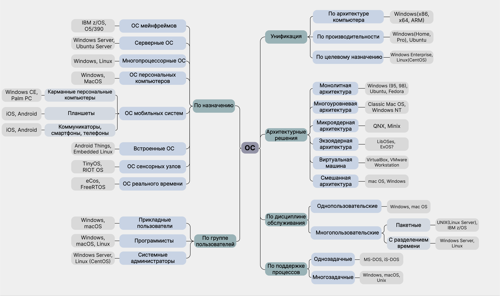

# Евсюков Александр БПИ224   Домашняя работа №1
## _Условие:_
Привести примеры различных ОС, привязав их к классификации, рассмотренной на лекции. Для отличной оценки привести минимум по два варианта для всех позиции со знаком вопроса. Для оценки на 6 баллов достаточно привести по одной ОС для каждого критерия. Следует отметить, что одна и та же ОС может повторяться в различных ветвях классификации.

_Опционально +1 балл_ 
Дополнительно к представленной классификации привести ссылки на источники информации или сайты разработчиков для ОС, представленных в задании.

_Опционально +1 балл_ 
Описать операционную систему, которой Вы отдаете предпочтение и пояснить, почему она <<круче>> других ОС, опираясь на свои знания навыки, используемые инструменты. Что не позволяет Вам поменять данную ОС на другие?

## _Решение:_

`Примечание:` 
Есть некоторые сомнения касательно примеров экзоядерной архитектуры. Исходя из полученной в интернете информации я понял, что для работы с экзоядрами используют не конкретные ОС, а специализированные библиотеки, которые помогают ОС работать с такими ядрами, так как 
единая ОС не является достаточно гибкой, чтобы все программы нормально функционировали. Такая ОС вводит слишком много механизмов и понятий абстракции для достижения доступных физических ресурсов. 
 Данная картинка также представлена в формате pdf, ее можно найти в корне папки `HW1`.

### _Описать операционную систему, которой Вы отдаете предпочтение:_
В моем случае я отдаю предпочтение Windows 10, так как это стабильная и дружелюбная по отношению к пользователю ОС, но уже задумываюсь о переходе к Windows 11. Возможно также это потому, что я уже очень давно пользуюсь именно этой системой. В основном ее преимущества проявляются в том, что существует множество программного обеспечения, которое стабильно работает с этой ОС (к примеру Photoshop). Также немаловажным для меня фактом является совместимость со всеми современными играми, в которые я время от времени играю) Однако, как программиста, меня привлекают UNIX системы, так как в них реализованы системы пакетов, что очень упрощает настройку среды разработки, но я пока не готов к ним переходить.

### _Ссылки на источники информации или сайты разработчиков:_
* Windows - https://www.microsoft.com/en-us/windows?r=1
* Windows Server - https://ru.wikipedia.org/wiki/Windows_Server
* Ubuntu - https://ubuntu.com/
* Android - https://www.android.com/
* iOS, macOS - https://www.apple.com
* Мейнфрейм - https://ru.wikipedia.org/wiki/%D0%9C%D0%B5%D0%B9%D0%BD%D1%84%D1%80%D0%B5%D0%B9%D0%BC
* КПК - https://ru.wikipedia.org/wiki/%D0%9A%D0%B0%D1%80%D0%BC%D0%B0%D0%BD%D0%BD%D1%8B%D0%B9_%D0%BF%D0%B5%D1%80%D1%81%D0%BE%D0%BD%D0%B0%D0%BB%D1%8C%D0%BD%D1%8B%D0%B9_%D0%BA%D0%BE%D0%BC%D0%BF%D1%8C%D1%8E%D1%82%D0%B5%D1%80
     https://ru.wikipedia.org/wiki/Windows_CE
* TinyOS - http://www.tinyos.net/
* RIOT OS - https://www.riot-os.org/
* Встраиваемые ОС - https://ru.wikipedia.org/wiki/%D0%9A%D0%B0%D1%82%D0%B5%D0%B3%D0%BE%D1%80%D0%B8%D1%8F:%D0%92%D1%81%D1%82%D1%80%D0%B0%D0%B8%D0%B2%D0%B0%D0%B5%D0%BC%D1%8B%D0%B5_%D0%BE%D0%BF%D0%B5%D1%80%D0%B0%D1%86%D0%B8%D0%BE%D0%BD%D0%BD%D1%8B%D0%B5_%D1%81%D0%B8%D1%81%D1%82%D0%B5%D0%BC%D1%8B
* eCos - https://ecos.sourceware.org/
     https://ru.wikipedia.org/wiki/ECos
* FreeRTOS - https://www.freertos.org/index.html
* CentOS - https://www.centos.org/
* Fedora - https://fedoraproject.org/ru/
* QNX - https://blackberry.qnx.com/en
* Minix - https://www.minix3.org/
* Экзо-ядро - https://ru.frwiki.wiki/wiki/Exo-noyau#Exo-noyau_pour_syst%C3%A8me_embarqu%C3%A9
      https://pdos.csail.mit.edu/archive/exo/
* VirtualBox - https://www.virtualbox.org/
* VMware Workstation - https://www.vmware.com/products/workstation-pro.html
* Однозадачные - https://ru.wikipedia.org/wiki/%D0%9A%D0%B0%D1%82%D0%B5%D0%B3%D0%BE%D1%80%D0%B8%D1%8F:%D0%94%D0%B8%D1%81%D0%BA%D0%BE%D0%B2%D1%8B%D0%B5_%D0%BE%D0%B4%D0%BD%D0%BE%D0%B7%D0%B0%D0%B4%D0%B0%D1%87%D0%BD%D1%8B%D0%B5_%D0%BE%D0%BF%D0%B5%D1%80%D0%B0%D1%86%D0%B8%D0%BE%D0%BD%D0%BD%D1%8B%D0%B5_%D1%81%D0%B8%D1%81%D1%82%D0%B5%D0%BC%D1%8B    