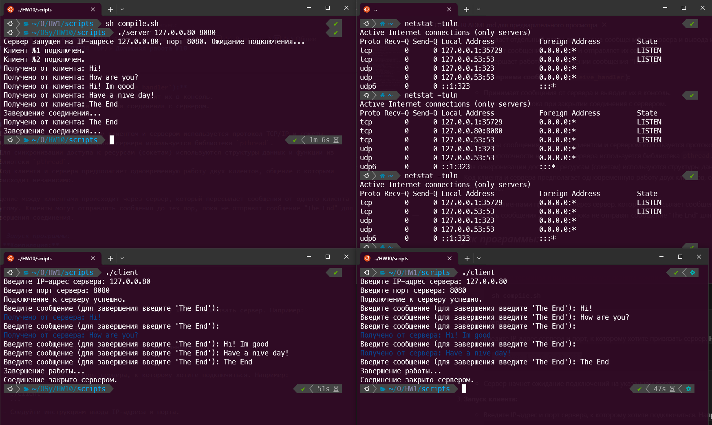

# Евсюков Александр БПИ224 <br/> Домашняя работа №10
## _Условие:_
Разработать клиент-серверное приложение, использующее TCP/IP и реализующее следующие взаимодействия: клиент №1 передает сообщения серверу, который перенаправляет их клиенту №2. В качестве исходных данных задавать: IP-адрес сервера, порт сервера. Эти данные можно задавать либо в командной строке, либо с использованием функций стандартного ввода.
Передаваемое сообщение задается из стандартного ввода в цикле. То есть, можно передать не одно а несколько сообщений от клиента №1 клиенту №2. При передаче сообщения The End необходимо завершить работу как клиентов, так и сервера.

Приложение должно функционировать в конфигурациях от одного до трех компьютеров с различными комбинациями размещения клиентов и сервера.

## _Решение:_
Файлы с решением лежат в папке `scripts`

### Сервер (server.c)
1. **Главная функция (`main`):**
   - Принимает аргументы командной строки: IP-адрес и порт сервера.
   - Создает сокет и связывает его с указанным адресом и портом.
   - Ожидает подключения двух клиентов (код ожидания `listen`).
   - Создает потоки для обработки соединений с каждым клиентом и передает им соответствующие сокеты.
   - Завершает работу потоков и освобождает ресурсы при завершении соединения.

2. **Функция обработки соединения (`handle_connection`):**
   - Принимает сообщения от клиента.
   - Пересылает полученное сообщение другому клиенту.
   - Выходит из потока при отключении клиента или получении сообщения "The End".

### Клиент
1. **Главная функция (`main`):**
   - Запрашивает у пользователя IP-адрес и порт сервера.
   - Создает сокет и подключается к серверу.
   - Создает отдельный поток для приема сообщений от сервера и вывода их в консоль.
   - Вводит сообщения с консоли и отправляет их серверу.
   - Завершает работу при получении сообщения "The End".

2. **Функция приема сообщений (`receive_handler`):**
   - Принимает сообщения от сервера и выводит их в консоль.
   - Выходит из потока при закрытии соединения с сервером.

### Общее
- Для обмена сообщениями между клиентом и сервером используется протокол TCP/IP и сокеты.
- Для многопоточности на стороне сервера используется библиотека `pthread`.
- Для синхронизации доступа к ресурсам (сокетам) используются структуры данных и функции из библиотеки `pthread`.
- Код клиента и сервера предполагает одновременную работу двух клиентов, общение с которыми происходит независимо.

Общение между клиентами происходит через сервер, который пересылает сообщения от одного клиента другому. Клиенты могут отправлять сообщения до тех пор, пока не отправят сообщение "The End" для завершения соединения.

## _Запуск программы:_
1. **Компиляция:**
   - Откройте терминал и выполните запуск скрипта компиляции:
     ```
     sh compile.sh
     ```

2. **Запуск сервера:**
   - Введите IP-адрес сервера и порт, к которому хотите привязать сервер. Например:
     ```
     ./server 127.0.0.80 8080
     ```
   - Сервер начнет ожидание подключений на указанном порту.

3. **Запуск клиента:**
   - Введите IP-адрес и порт сервера, к которому хотите подключиться. Например:
     ```
     ./client
     ```
   - Следуйте инструкциям ввода IP-адреса и порта.

4. **Повторите шаг 3 для второго клиента:**
   - Откройте новое окно терминала или новую вкладку.
   - Снова запустите клиентскую программу и подключитесь к тому же серверу.

Теперь вы можете обмениваться сообщениями между клиентами через сервер.

## _Пример работы программы:_
