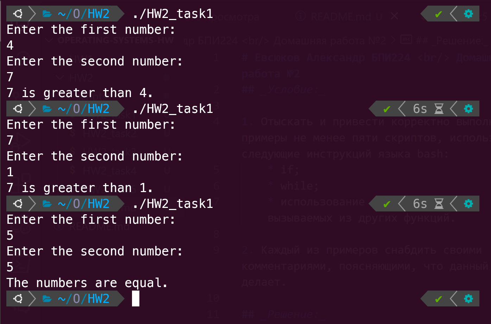
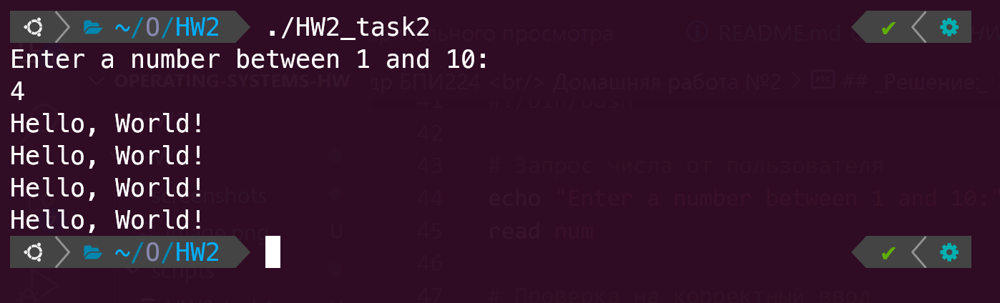
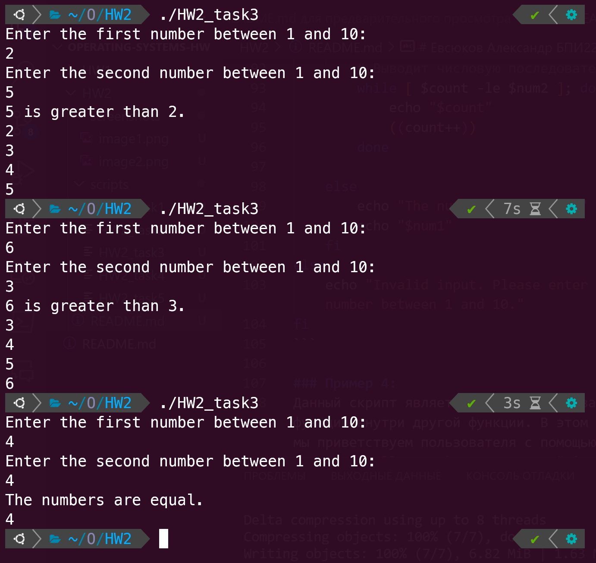
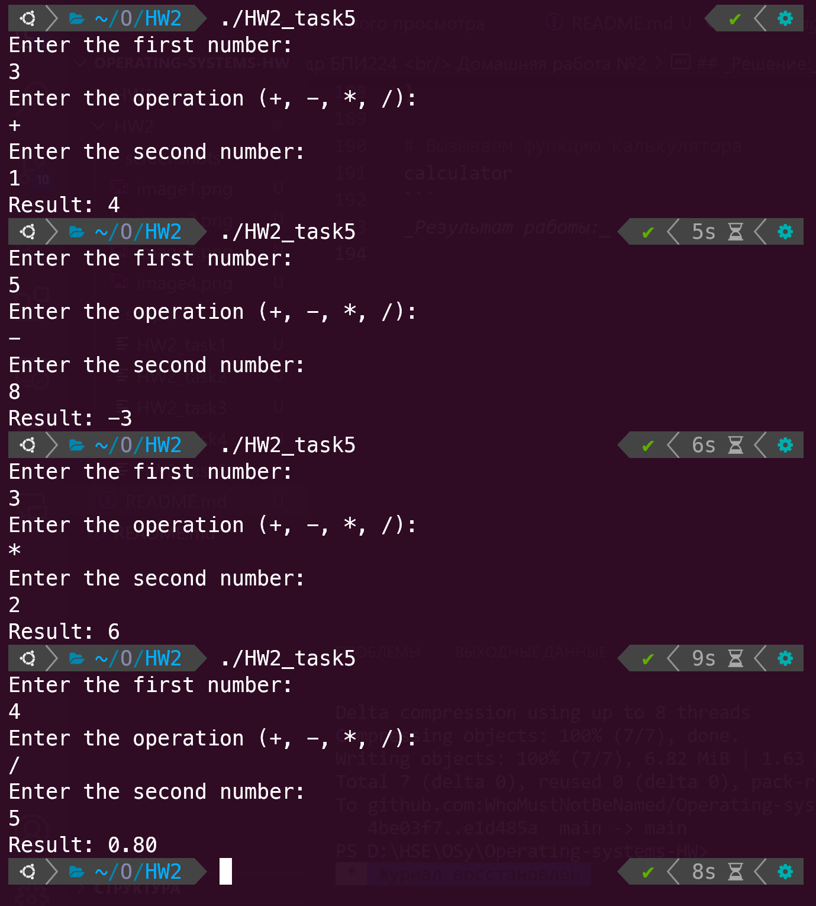

# Евсюков Александр БПИ224 <br/> Домашняя работа №2
## _Условие:_

1. Отыскать и привести корректно выполняемые примеры не менее пяти скриптов, использующих следующие инструкций языка bash:
    * if;
    * while;
    * использование функций на bash, вызываемых из других функций.

2. Каждый из примеров снабдить своими комментариями, поясняющими, что данный скрипт делает.

## _Решение:_

### Пример 1: 
Скрипт, который получает от пользователя два числа и путем сравнения определяет какое число больше.
``` shell
#!/bin/bash

# Получаем входные данные от пользователя
echo "Enter the first number:"
read num1

echo "Enter the second number:"
read num2

# Сравниваем числа и выводим результат
if [ $num1 -gt $num2 ]; then
    echo "$num1 is greater than $num2."
elif [ $num1 -lt $num2 ]; then
    echo "$num2 is greater than $num1."
else
    echo "The numbers are equal."
fi
```
_Результат работы:_


### Пример 2:
Данный скрипт получает число от пользователя в пределах от 1 до 10 и выводит нужное количество раз строку `Hello, World!`. Если было введено число больше 10 или меньше 1, то программа сообщает о некорректном вводе.

``` shell
#!/bin/bash

# Запрос числа от пользователя
echo "Enter a number between 1 and 10:"
read num

# Проверка на корректный ввод
if [ $num -ge 1 -a $num -le 10 ]; then
    count=1

    # Вывод строки нужное количество раз
    while [ $count -le $num ]; do
        echo "Hello, World!"
        ((count++))
    done
else
    echo "Invalid input. Please enter a number between 1 and 10."
fi
```
_Результат работы:_



### Пример 3:
Данный скрипт является модификацией двух предыдущих. Он получает на вход два значения, сравнивает числа и сообщает какое из них больше, а после выводит числовую последовательность в промежутке [меньшее, большее]. 

``` shell
#!/bin/bash

# Получаем входные данные от пользователя
echo "Enter the first number between 1 and 10:"
read num1

echo "Enter the second number between 1 and 10:"
read num2

# Сравниваем числа и выводим результат
if [ $num1 -ge 1 -a $num1 -le 10 -a $num2 -ge 1 -a $num2 -le 10 ]; then
    if [ $num1 -gt $num2 ]; then
        echo "$num1 is greater than $num2."
        count=$num2
        # Выводит числовую последовательность
        while [ $num1 -ge $count ]; do 
            echo "$count"
            ((count++))
        done

    elif [ $num1 -lt $num2 ]; then
        echo "$num2 is greater than $num1."
        count=$num1

        # Выводит числовую последовательность
        while [ $count -le $num2 ]; do 
            echo "$count"
            ((count++))
        done

    else
        echo "The numbers are equal."
        echo "$num1"
    fi
else
    echo "Invalid input. Please enter a number between 1 and 10."
fi
```
_Результат работы:_


### Пример 4:
Данный скрипт является примером вызова функции внутри другой функции. В этом примере мы приветствуем пользователя с помощью функции `hello_user` и внутри этой функции вызываем функцию `get_name`, которая определяет и возвращает имя пользователя.

``` shell
#!/bin/bash

# Функция получения имени пользователя
get_name() {
    name=$(whoami)
    echo $name
}

# Функция приветствия пользователя
hello_user() {
    user=$(get_name)
    echo "Hello $user!"
}

hello_user
```
_Результат работы:_


### Пример 5:
Этот скрипт является примером простого калькулятора. Имеется функция `calculator`, которая запрашивает у пользователя два числа и оператор (+, -, *, /), затем реализован блок `case`, который вызывает функции `add`, `substract`, `multiply` и `devide` в зависимости от полученного оператора. 

``` shell 
#!/bin/bash

# Функция сложения
add() {
    result=$(( $1 + $2 ))
    echo $result
}

# Функция вычитания
subtract() {
    result=$(( $1 - $2 ))
    echo $result
}

# Функция умножения
multiply() {
    result=$(( $1 * $2 ))
    echo $result
}

# Функция деления
divide() {
    if [ $2 -eq 0 ]; then
        echo "Error: Division by zero!"
    else
        # какая-то очень приятная функция найденая в инете, 
        # которая делит числа с 2 знаками после запятой (еще были примеры с sed)
        result=$(awk "BEGIN {printf \"%.2f\", $1 / $2}")
        echo $result 
    fi
}

# Функция калькулятора
calculator() {
    echo "Enter the first number:"
    read num1

    echo "Enter the operation (+, -, *, /):"
    read operation

    echo "Enter the second number:"
    read num2

    case $operation in
        "+") result=$(add $num1 $num2);;
        "-") result=$(subtract $num1 $num2);;
        "*") result=$(multiply $num1 $num2);;
        "/") result=$(divide $num1 $num2);;
        *) echo "Invalid operation!"; exit 1;;
    esac

    echo "Result: $result"
}

# Вызываем функцию калькулятора
calculator
```
_Результат работы:_
