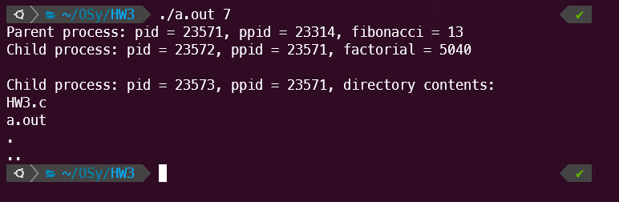
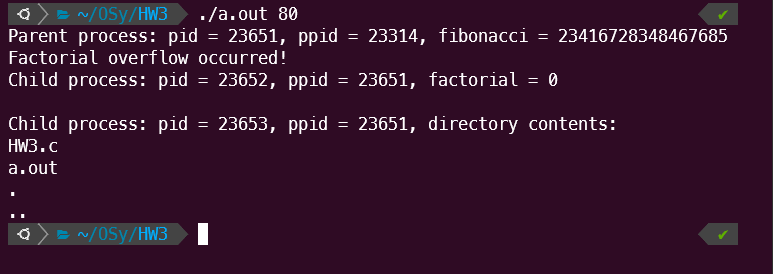
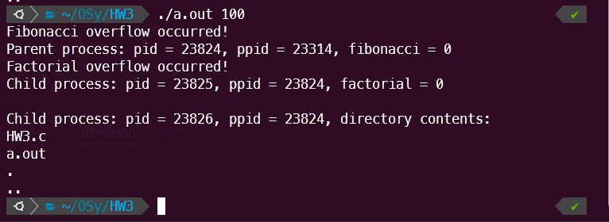

# Евсюков Александр БПИ224 <br/> Домашняя работа №3
## _Условие:_
_До 8 баллов_

Разработать программу в которой родительский процесс вычисляет число Фибоначчи, а процесс-ребенок вычисляет значение факториала. В качестве исходного значения используется аргумент из командной строки. Использовать беззнаковую 64-разрядную целочисленную арифметику. Не забыть зафиксировать возникновение переполнения.

_Опционально +2 балла_

Для всех процессов вывести на экран дополнительную информацию об их потомках и родителях. Организовать в программе дополнительно запуск процесса, который по завершении вычислений и выводе результатов выводит информацию о содержимом текущего каталога.

## _Решение:_
``` c
#include <stdio.h>
#include <stdlib.h>
#include <unistd.h>
#include <sys/types.h>
#include <sys/wait.h>
#include <dirent.h>

// Функция для вычисления факториала
unsigned long long factorial(int n) {
    unsigned long long fact = 1;
    for(int i = 1; i <= n; ++i) {
        // Проверка на переполнение
        if (fact * i < fact) {
            printf("Factorial overflow occurred!\n");
            return 0;
        }
        fact *= i;
    }
    return fact;
}

// Функция для вычисления числа Фибоначчи
unsigned long long fibonacci(int n) {
    unsigned long long fib1 = 0, fib2 = 1, fib3;
    if (n == 0) return 0;
    for(int i = 2; i <= n; ++i) {
        // Проверка на переполнение
        fib3 = fib1 + fib2;
        if (fib3 < fib1) {
            printf("Fibonacci overflow occurred!\n");
            return 0;
        }
        fib1 = fib2;
        fib2 = fib3;
    }
    return fib2;
}

// Функция для вывода содержимого текущего каталога
void print_directory_contents() {
    DIR *d;
    struct dirent *dir;
    d = opendir(".");
    if (d) {
        while ((dir = readdir(d)) != NULL) {
            printf("%s\n", dir->d_name);
        }
        closedir(d);
    }
}

int main(int argc, char *argv[]) {
    if (argc != 2) {
        printf("Usage: %s <number>\n", argv[0]);
        return 1;
    }

    int n = atoi(argv[1]);

    // Создание процесса-ребенка
    pid_t pid = fork();

    if (pid == 0) {
        // Код для процесса-ребенка
        printf("Child process: pid = %d, ppid = %d, factorial = %llu\n", getpid(), getppid(), factorial(n));
    } else {
        // Код для родительского процесса
        printf("Parent process: pid = %d, ppid = %d, fibonacci = %llu\n", getpid(), getppid(), fibonacci(n));
        wait(NULL);

        // Создание второго процесса-ребенка для вывода информации о каталоге
        pid_t pid2 = fork();

        if (pid2 == 0) {
            // Код для второго процесса-ребенка
            printf("\nChild process: pid = %d, ppid = %d, directory contents:\n", getpid(), getppid());
            print_directory_contents();
        } else {
            wait(NULL);
        }
    }

    return 0;
}
```

## _Пример работы программы:_


