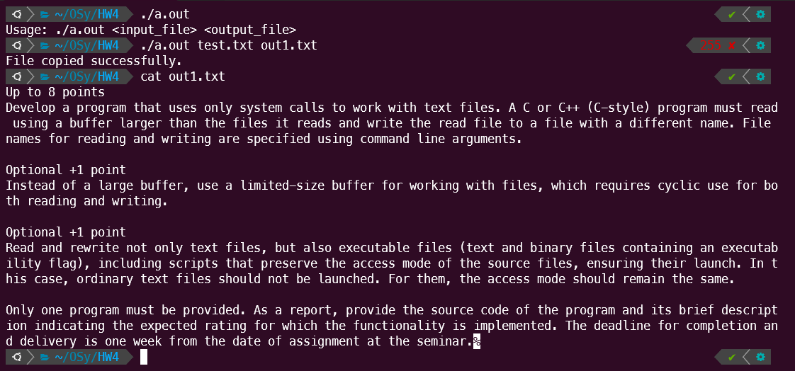
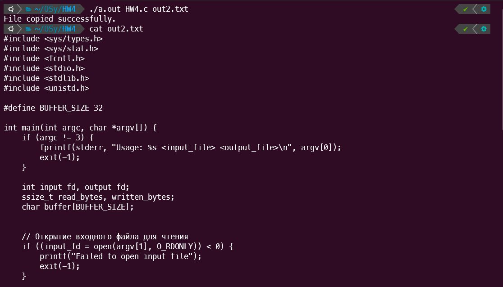
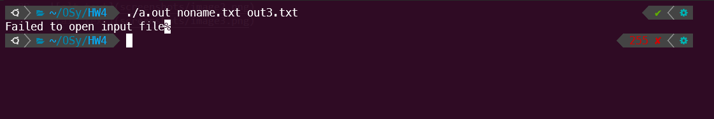

# Евсюков Александр БПИ224 <br/> Домашняя работа №4
## _Условие:_
_До 8 баллов_

Разработать программу использующую для работы с текстовыми файлами только системные вызовы. Программа на языке C или C++ (в стиле C) должна прочитать, используя буфер, размер которого превышает читаемые файлы  и записать прочитанный файл в файл с другим именем. Имена файлов для чтения и записи задавать с использованием аргументов командной строки.

_Опционально +1 балл_

Вместо большого буфера использовать для работы с файлами буфер ограниченного размера, требующий циклического использования как для чтения, так и для записи.

_Опционально +1 балл_

Читать и переписывать не только текстовые, но и исполняемые файлы (текстовые и бинарные, содержащие признак исполняемости), включая скрипты, которые сохраняют режим доступа исходных файлов, обеспечивающий их запуск. При этом обычные текстовые файлы запускаться не должны. Для них режим доступа должен оставаться прежним.

Необходимо предоставить только одну программу. В качестве отчета предоставить исходные тексты программы и ее краткое описание с указанием, на какую ожидаемую оценку реализован функционал. Срок выполнения и сдачи --- одна неделя с момента выдачи задания на семинаре.

## _Решение на 9 баллов:_
``` c
#include <sys/types.h>
#include <sys/stat.h>
#include <fcntl.h>
#include <stdio.h>
#include <stdlib.h>
#include <unistd.h>

const int BUFFER_SIZE = 32;

int main(int argc, char *argv[]) {
    if (argc != 3) {
        fprintf(stderr, "Usage: %s <input_file> <output_file>\n", argv[0]);
        exit(-1);
    }

    int input_fd, output_fd;
    ssize_t read_bytes, written_bytes;
    char buffer[BUFFER_SIZE];
  

    // Открытие входного файла для чтения
    if ((input_fd = open(argv[1], O_RDONLY)) < 0) {
        printf("Failed to open input file");
        exit(-1);
    }

    // Открытие выходного файла для записи
    if ((output_fd = open(argv[2], O_WRONLY | O_CREAT | O_TRUNC, 0666)) < 0) {
        printf("Failed to open output file");
        close(input_fd);
        exit(-1);
    }

    // Чтение из входного файла и запись в выходной файл
    while ((read_bytes = read(input_fd, buffer, BUFFER_SIZE)) > 0) {
        written_bytes = write(output_fd, buffer, read_bytes);
        if (written_bytes != read_bytes) {
            printf("Failed to write to output file");
            close(input_fd);
            close(output_fd);
            exit(-1);
        }
    }

    // Проверка на ошибку чтения
    if (read_bytes < 0) {
        printf("Failed to read from input file");
        close(input_fd);
        close(output_fd);
        exit(-1);
    }

    // Закрытие файлов
    if (close(input_fd) < 0) {
        printf("Failed to close input file");
        exit(-1);
    }

    if (close(output_fd) < 0) {
        printf("Failed to close output file");
        exit(-1);
    }

    printf("File copied successfully.\n");
    return 0;
}
```

## _Пример работы программы:_



