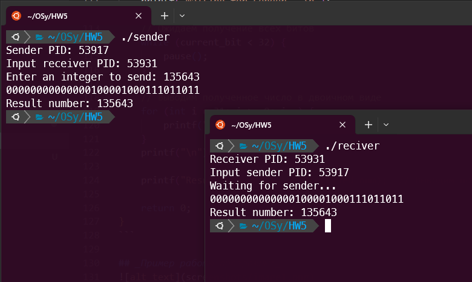

# Евсюков Александр БПИ224 <br/> Домашняя работа №5
## _Условие:_
Необходимо написать две программы — передатчик и приемник , которые будут запускаться с разных терминалов. Каждая программа в начале печатает свой PID и запрашивает ввод с клавиатуры PID программы–собеседника (вводится пользователем). Порядок ввода PID не имеет значения. Программа—передатчик запрашивает с клавиатуры ввод целого десятичного числа (число может быть и отрицательным!). Введенное число побитово передается программе-приемнику с использованием пользовательских сигналов SIGUSR1 и SIGUSR2. Программа–приемник после завершения приема печатает принятое число в десятичной системе счисления.

_До 7 баллов_

Каждый бит (0 или 1) передается своим сигналом. Из-за ненадежности сигналов передача последовательности одинаковых битов может приводить к ошибкам. Особенно при односторонней передаче без обратной связи. Но можно попытаться повысить (в общем случае негарантированно) за счет задержки. На данную оценку допустим такой вариант решения.

_До 10 баллов_
Каждый новый бит можно передавать только после подтверждения от приемника принятия предыдущего с помощью одного из пользовательских сигналов, организуя асинхронное взаимодействие. Также необходимо продумать каким образом асинхронно (а не по числу переданных бит) завершить передачу между источником и приемником.

## _Решение:_
Код для передатчика `sender.c`:
``` c
#include <stdio.h>
#include <stdlib.h>
#include <signal.h>
#include <unistd.h>

int receiver_pid;  // PID приемника
int current_bit = 0;  // Текущий передаваемый бит
int num_to_send;  // Число для передачи

// Функция для отправки одного бита по сигналу
void send_bit(int bit) {
    if (bit)
        kill(receiver_pid, SIGUSR2);  // Отправить SIGUSR2, если бит равен 1
    else
        kill(receiver_pid, SIGUSR1);  // Отправить SIGUSR1, если бит равен 0
}

// Обработчик сигнала SIGUSR1
void handler(int sig) {
    if (sig == SIGUSR1) {
        current_bit++;
        if (current_bit < 32) {
            // Передача следующего бита, если еще не все переданы
            send_bit((num_to_send >> current_bit) & 1);
        } else {
            // Все биты переданы, вывод результата и завершение программы
            for (int i = 31; i >= 0; i--) {
                printf("%d", (num_to_send >> i) & 1);
            }
            printf("\n");
            printf("Result number: %d\n", num_to_send);
            exit(0);
        }
    }
}

int main() {
    printf("Sender PID: %d\n", getpid());  // Вывести PID отправителя
    printf("Input receiver PID: ");
    scanf("%d", &receiver_pid);  // Получить PID приемника от пользователя

    printf("Enter an integer to send: ");
    scanf("%d", &num_to_send);  // Получить число для передачи от пользователя

    signal(SIGUSR1, handler);  // Установить обработчик для SIGUSR1

    // Начать передачу, отправив первый бит
    send_bit(num_to_send & 1);

    // Ожидание сигналов
    while (1) {
        pause();
    }

    return 0;
}
```

Код для приемника `reciver.c`
``` c
#include <stdio.h>
#include <stdlib.h>
#include <signal.h>
#include <unistd.h>

int sender_pid;  // PID передатчика
int received_num = 0;  // Полученное число
int current_bit = 0;  // Текущий полученный бит

// Обработчик сигнала SIGUSR1
void sigusr1_handler(int sig) {
    // Записываем полученный бит в число
    received_num |= (0 << current_bit);
    current_bit++;
    // Посылаем сигнал передатчику для подтверждения получения
    kill(sender_pid, SIGUSR1);
}

// Обработчик сигнала SIGUSR2
void sigusr2_handler(int sig) {
    // Записываем полученный бит в число
    received_num |= (1 << current_bit);
    current_bit++;
    // Посылаем сигнал передатчику для подтверждения получения
    kill(sender_pid, SIGUSR1);
}

int main() {
    printf("Receiver PID: %d\n", getpid());  // Выводим PID приемника
    printf("Input sender PID: ");
    scanf("%d", &sender_pid);  // Получаем PID передатчика от пользователя

    // Устанавливаем обработчики для SIGUSR1 и SIGUSR2
    signal(SIGUSR1, sigusr1_handler);
    signal(SIGUSR2, sigusr2_handler);

    printf("Waiting for sender...\n");

    // Ожидаем получение всех битов
    while (current_bit < 32) {
        pause();
    }

    // Выводим полученное число в двоичном виде
    for (int i = 31; i >= 0; i--) {
        printf("%d", (received_num >> i) & 1);
    }
    printf("\n");

    printf("Result number: %d\n", received_num);  // Выводим полученное число

    return 0;
}
```

## _Пример работы программы:_



## _Примечание:_
При переносе из одной папки в другую заметил, что скомпелированные файлы не хотят запускаться, поэтому для решения этой проблемы перекомпелируйте программы, если они не будут работать. Мой пример компиляции с использованием `clang`:
```
clang sender.c -o sender
clang reciver.c -o reciver
```