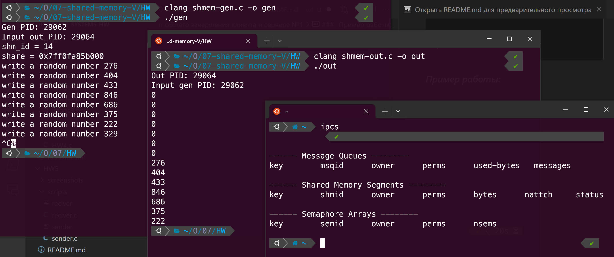
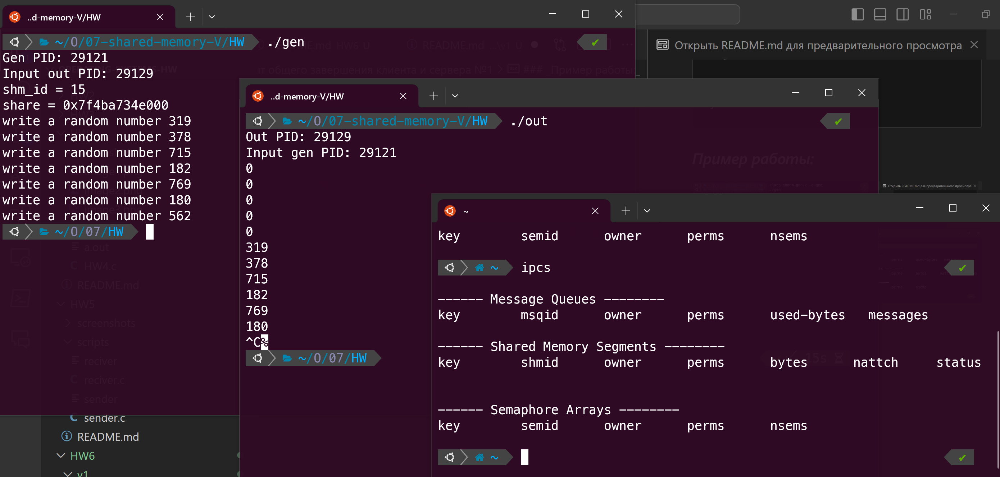

# Вариант общего завершения клиента и сервера №1

### _Решение:_ 
Первый вариант завершения основан на передаче сигнала завершения от одного процесса другому. Для этого мы сохраняем PID процессов перед началом работы и потом передаем им нужный сигнал. Решение лежит в папке `scripts`.


``` c
// shmem-gen.c
#include <stdio.h>
#include <unistd.h>
#include <sys/shm.h>
#include <stdlib.h>
#include <time.h>
#include <error.h>
#include <signal.h>

int shm_id;
int *share;
int out_pid; 

// Метод завершения, который вызывается после получения сигнала о завершении
void cleanup(int signum) {
    if (signum == SIGINT ) {
        kill(out_pid, SIGINT); 
    }
    shmdt(share);
    shmctl(shm_id, IPC_RMID, NULL);
    exit(0);
}

int main(){
    printf("Gen PID: %d\n", getpid());
    printf("Input out PID: ");
    scanf("%d", &out_pid);  // Получить PID out от пользователя

  int num;

  signal(SIGINT, cleanup); // Обработка сигнала

  srand(time(NULL));
  shm_id = shmget (0x2FF, getpagesize(), 0666 | IPC_CREAT);
  printf("shm_id = %d\n", shm_id);
  if(shm_id < 0){
    perror("shmget()");
    exit(1);
  }

  share = (int *)shmat(shm_id, 0, 0);
  if(share == NULL){
    perror("shmat()");
    exit(2);
  }
  printf("share = %p\n", share);

  while(1){
    num = random() % 1000;
    *share = num;
    printf("write a random number %d\n", num);
    sleep(1);
  }
  return 0;
}
```

``` c
// shmem-out.c
#include<stdio.h>
#include<unistd.h>
#include<sys/shm.h>
#include<stdlib.h>
#include<error.h>
#include<signal.h>

int shm_id;
int *share;
int gen_pid;

// Метод обработки сигнала завершения
void cleanup(int signum) {
    if (signum == SIGINT ) {
        kill(gen_pid, SIGINT); // Передача сигнала другому процессу
    }

    shmdt(share);
    shmctl(shm_id, IPC_RMID, NULL);
    exit(0);
}

int main() {
    printf("Out PID: %d\n", getpid());
    printf("Input gen PID: ");
    scanf("%d", &gen_pid);  // Получить PID gen от пользователя

  signal(SIGINT, cleanup); // Обработка сигнала завершения

  shm_id = shmget (0x2FF, getpagesize(), 0666 | IPC_CREAT);
  if(shm_id == -1){
    perror("shmget()");
    exit(1);
  }

  share = (int *)shmat(shm_id, 0, 0);
  if(share == NULL){
    perror("shmat()");
    exit(2);
  }

  while(1){
    sleep(1);
    printf("%d\n", *share);
  }

  return 0;
}
```
### _Пример работы:_



## _Примечание:_
При переносе из одной папки в другую заметил, что скомпилированные файлы не хотят запускаться, поэтому для решения этой проблемы перекомпилируйте программы, если они не будут работать. Мой пример компиляции с использованием `clang`:
```
clang shmem-gen.c -o gen
clang shmem-out.c -o out
```