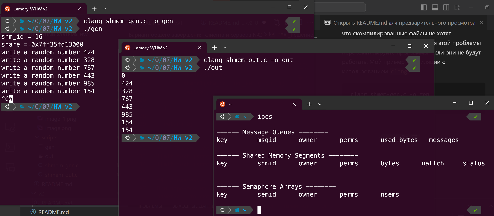
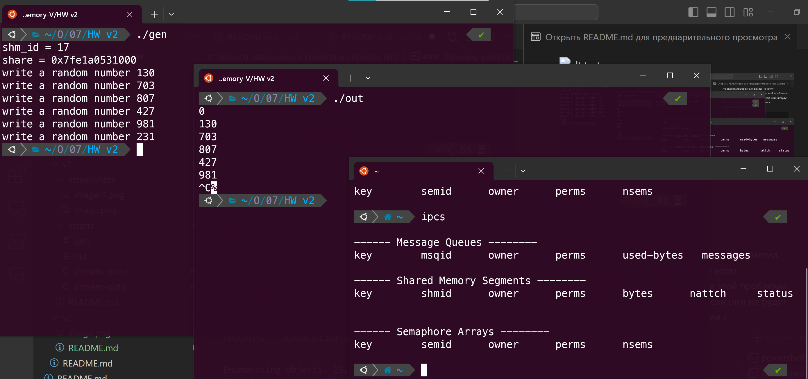

# Вариант общего завершения клиента и сервера №2

### _Решение:_ 
Второй вариант завершения основан на том, что в сегменте памяти мы храним структуру, которая имеет нашу передаваемую переменную и флаг. Если поступает сигнал завершения одной из программ, мы меняем флаг на равный 1 и вторая программа после прочтения этого флаг тоже завершает свою работу. Для завершения работы используйте `Ctrl+C`. Решение лежит в папке `scripts`.

``` c
// shmem-gen.c
#include <stdio.h>
#include <unistd.h>
#include <sys/shm.h>
#include <stdlib.h>
#include <time.h>
#include <error.h>
#include <signal.h>

// Структура для хранения двух переменных в сегменте памяти
typedef struct {
    int num;
    int flag;
} SharedData;

int shm_id;
SharedData *share;

void cleanup(int signum) {
    if (signum == SIGINT) {
        share->flag = 1; // Если поступил сигнал завершения, устанавливаем флаг равный 1
        sleep(1);
        shmdt(share);
        shmctl(shm_id, IPC_RMID, NULL);
        exit(0);
    }
}

int main(){
  int num;

  signal(SIGINT, cleanup);

  srand(time(NULL));
  shm_id = shmget (0x2FF, getpagesize(), 0666 | IPC_CREAT);
  printf("shm_id = %d\n", shm_id);
  if(shm_id < 0){
    perror("shmget()");
    exit(1);
  }

  share = (SharedData *)shmat(shm_id, 0, 0);
  if(share == NULL){
    perror("shmat()");
    exit(2);
  }
  printf("share = %p\n", share);

  while(1){
    num = random() % 1000;
    share->num = num;
    printf("write a random number %d\n", num);
    sleep(1);

    // Если флаг завершения стал равен 1, 
    // то мы отсоединяемся и завершаем работу
    if (share->flag == 1) {
        shmdt(share);
        shmctl(shm_id, IPC_RMID, NULL);
        exit(0);
    }
  }
  return 0;
}
```

``` c
// shmem-out.c
#include<stdio.h>
#include<unistd.h>
#include<sys/shm.h>
#include<stdlib.h>
#include<error.h>
#include<signal.h>

// Структура для хранения двух переменных в сегменте памяти
typedef struct {
    int num;
    int flag;
} SharedData;

int shm_id;
SharedData *share;

void cleanup(int signum) {
    if (signum == SIGINT) {
        share->flag = 1; // Если поступил сигнал завершения, устанавливаем флаг равный 1
        sleep(1);
        shmdt(share);
        shmctl(shm_id, IPC_RMID, NULL);
        exit(0);
    }
}

int main() {
  signal(SIGINT, cleanup);

  shm_id = shmget (0x2FF, getpagesize(), 0666 | IPC_CREAT);
  if(shm_id == -1){
    perror("shmget()");
    exit(1);
  }

  share = (SharedData *)shmat(shm_id, 0, 0);
  if(share == NULL){
    perror("shmat()");
    exit(2);
  }

  while(1){
    sleep(1);
    printf("%d\n", share->num);

    // Если флаг завершения стал равен 1, 
    // то мы отсоединяемся и завершаем работу
    if (share->flag == 1) {
        shmdt(share);
        shmctl(shm_id, IPC_RMID, NULL);
        exit(0);
    }
  }

  return 0;
}
```
### _Пример работы:_



## _Примечание:_
При переносе из одной папки в другую заметил, что скомпилированные файлы не хотят запускаться, поэтому для решения этой проблемы перекомпилируйте программы, если они не будут работать. Мой пример компиляции с использованием `clang`:
```
clang shmem-gen.c -o gen
clang shmem-out.c -o out
```