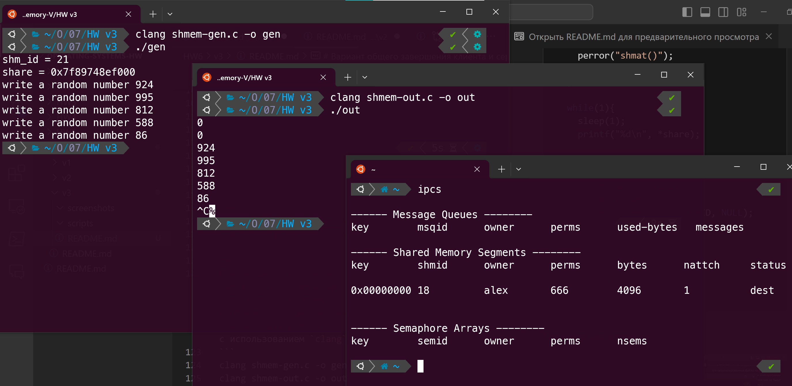
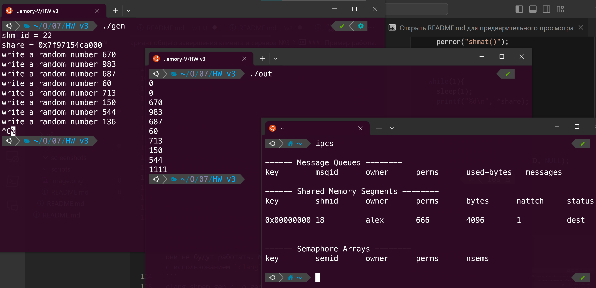

# Вариант общего завершения клиента и сервера №3

### _Решение:_ 
Третий вариант завершения достаточно ленивый, он основан на том, что при получении сигнала завершения программа устанавливает в сегмент памяти значение выходящее за пределы диапазона генерации случайных чисел, а другая программа после чтения этого значения тоже завершает свою работу. Для завершения работы используйте `Ctrl+C`. Решение лежит в папке `scripts`.

``` c
// shmem-gen.c
#include <stdio.h>
#include <unistd.h>
#include <sys/shm.h>
#include <stdlib.h>
#include <time.h>
#include <error.h>
#include <signal.h>

int shm_id;
int *share;


// Метод завершения, который вызывается после получения сигнала о завершении
void cleanup(int signum) {
  *share = 1111; //Устанавоиваем значение, которое будет являться сигналом для завершения
  sleep(1);
  shmdt(share);
  shmctl(shm_id, IPC_RMID, NULL);
  exit(0);
}

int main(){
  int num;

  signal(SIGINT, cleanup); // Обработка сигнала

  srand(time(NULL));
  shm_id = shmget (0x2FF, getpagesize(), 0666 | IPC_CREAT);
  printf("shm_id = %d\n", shm_id);
  if(shm_id < 0){
    perror("shmget()");
    exit(1);
  }

  share = (int *)shmat(shm_id, 0, 0);
  if(share == NULL){
    perror("shmat()");
    exit(2);
  }
  printf("share = %p\n", share);

  while(1){
    num = random() % 1000;
    *share = num;
    printf("write a random number %d\n", num);
    sleep(1);

    // Если переменная равно 1111, завершаем работу
    if (*share == 1111) {
      shmdt(share);
      shmctl(shm_id, IPC_RMID, NULL);
      exit(0);
    }
  }
  return 0;
}
```

``` c
// shmem-out.c
#include<stdio.h>
#include<unistd.h>
#include<sys/shm.h>
#include<stdlib.h>
#include<error.h>
#include<signal.h>

int shm_id;
int *share;

// Метод обработки сигнала завершения
void cleanup(int signum) {
  *share = 1111; //Устанавоиваем значение, которое будет являться сигналом для завершения
  sleep(1);
  shmdt(share);
  shmctl(shm_id, IPC_RMID, NULL);
  exit(0);
}

int main() {
  signal(SIGINT, cleanup); // Обработка сигнала завершения

  shm_id = shmget (0x2FF, getpagesize(), 0666 | IPC_CREAT);
  if(shm_id == -1){
    perror("shmget()");
    exit(1);
  }

  share = (int *)shmat(shm_id, 0, 0);
  if(share == NULL){
    perror("shmat()");
    exit(2);
  }

  while(1){
    sleep(1);
    printf("%d\n", *share);

    // Если переменная равно 1111, завершаем работу
    if (*share == 1111) {
      shmdt(share);
      shmctl(shm_id, IPC_RMID, NULL);
      exit(0);
    }
  }

  return 0;
}
```
### _Пример работы:_



## _Примечание:_
При переносе из одной папки в другую заметил, что скомпилированные файлы не хотят запускаться, поэтому для решения этой проблемы перекомпилируйте программы, если они не будут работать. Мой пример компиляции с использованием `clang`:
```
clang shmem-gen.c -o gen
clang shmem-out.c -o out
```