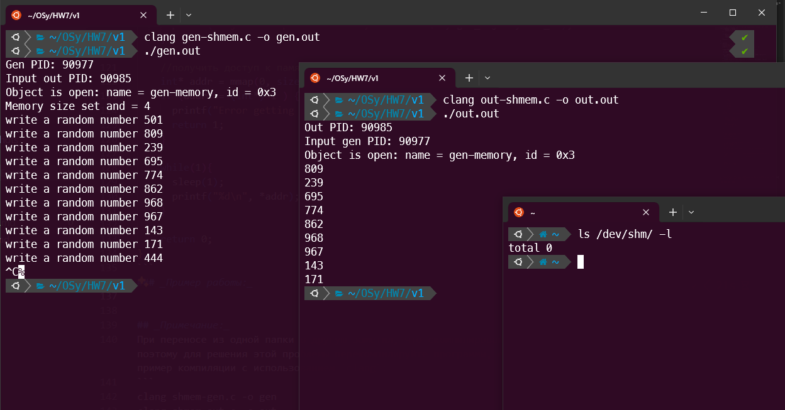
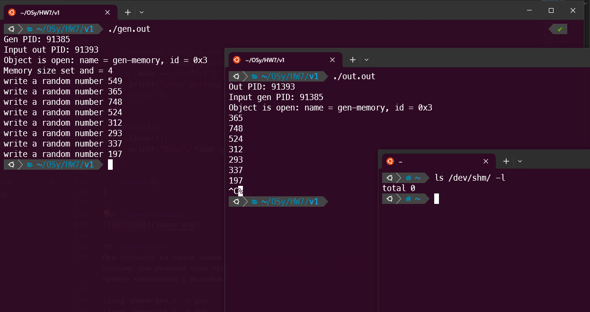

# Вариант общего завершения клиента и сервера №1

### _Решение:_ 
Первый вариант завершения основан на передаче сигнала завершения от одного процесса другому. Для этого мы сохраняем PID процессов перед началом работы и потом передаем им нужный сигнал. Для завершения работы используйте `Ctrl+C`. Решение лежит в папке `scripts`.

``` c
// gen-shmem.c
// write a random number between 0 and 999 to the shm every 1 second
#include <stdio.h>
#include <unistd.h>
#include <stdlib.h>
#include <time.h>
#include <sys/mman.h>
#include <fcntl.h>
#include <signal.h>

int shm_id;
int out_pid; 
char gen_object[] = "gen-memory"; //  имя объекта

// Метод завершения, который вызывается после получения сигнала о завершении
void cleanup(int signum) {
    if (signum == SIGINT ) {
        kill(out_pid, SIGINT); 
    }

    if(shm_id != -1) {
        shm_unlink(gen_object);
        close(shm_id);
    }
    exit(0);
}

int main(){
    printf("Gen PID: %d\n", getpid());
    printf("Input out PID: ");
    scanf("%d", &out_pid);  // Получить PID out от пользователя

    signal(SIGINT, cleanup); // Обработка сигнала завершения

    int num;

    if ( (shm_id = shm_open(gen_object, O_CREAT|O_RDWR, 0666)) == -1 ) {
      perror("shm_open");
      return 1;
    } else {
      printf("Object is open: name = %s, id = 0x%x\n", gen_object, shm_id);
    }
    // Задание размера объекта памяти
    if (ftruncate(shm_id, sizeof (num)) == -1) {
      perror("ftruncate");
      return 1;
    } else {
      printf("Memory size set and = %lu\n", sizeof (num));
    }

    srand(time(NULL));
    //получить доступ к памяти
    int* addr = mmap(0, sizeof(num), PROT_WRITE|PROT_READ, MAP_SHARED, shm_id, 0);
    if (addr == (int*)-1 ) {
      printf("Error getting pointer to shared memory\n");
      return 1;
    }

    while(1){
      num = random() % 1000;
      *addr = num;
      printf("write a random number %d\n", num);
      sleep(1);
    }
    return 0;
}

```

``` c
// out-shmem.c
// read from the shm every 1 second
#include<stdio.h>
#include<unistd.h>
#include<sys/shm.h>
#include<stdlib.h>
#include<error.h>
#include <sys/mman.h>
#include <fcntl.h>
#include <signal.h>

int shm_id;
int gen_pid;
char gen_object[] = "gen-memory"; //  имя объекта

// Метод завершения, который вызывается после получения сигнала о завершении
void cleanup(int signum) {
    if (signum == SIGINT ) {
        kill(gen_pid, SIGINT); 
    }
    
    if(shm_id != -1) {
        shm_unlink(gen_object);
        close(shm_id);
    }
    exit(0);
}

int main() {
    printf("Out PID: %d\n", getpid());
    printf("Input gen PID: ");
    scanf("%d", &gen_pid);  // Получить PID gen от пользователя

    signal(SIGINT, cleanup); // Обработка сигнала завершения

    //открыть объект
    if ( (shm_id = shm_open(gen_object, O_RDWR, 0666)) == -1 ) {
      printf("Opening error\n");
      perror("shm_open");
      return 1;
    } else {
      printf("Object is open: name = %s, id = 0x%x\n", gen_object, shm_id);
    }

    //получить доступ к памяти
    int* addr = mmap(0, sizeof(int), PROT_WRITE|PROT_READ, MAP_SHARED, shm_id, 0);
    if (addr == (int*)-1 ) {
      printf("Error getting pointer to shared memory\n");
      return 1;
    }

    while(1){
      sleep(1);
      printf("%d\n", *addr);
    }

    return 0;
}
```
### _Пример работы:_



## _Примечание:_
При переносе из одной папки в другую заметил, что скомпилированные файлы не хотят запускаться, поэтому для решения этой проблемы перекомпилируйте программы, если они не будут работать. Мой пример компиляции с использованием `clang`:
```
clang gen-shmem.c -o gen
clang out-shmem.c -o out
```