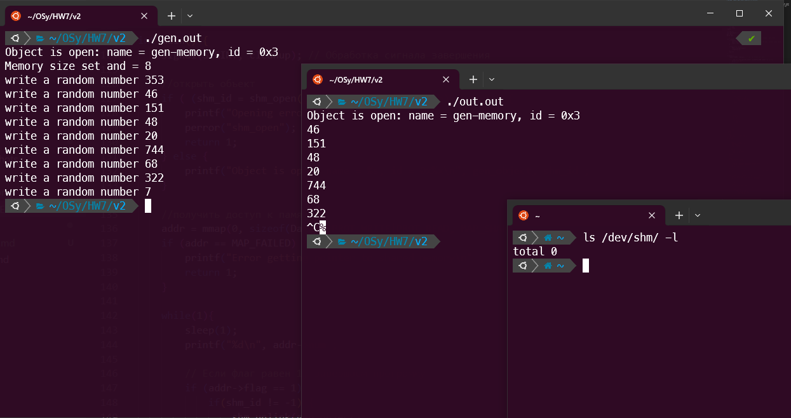

# Вариант общего завершения клиента и сервера №2

### _Решение:_ 
Второй вариант завершения основан на том, что в сегменте памяти мы храним структуру, которая имеет нашу передаваемую переменную и флаг. Если поступает сигнал завершения одной из программ, мы меняем флаг на равный 1 и вторая программа после прочтения этого флаг тоже завершает свою работу. Для завершения работы используйте `Ctrl+C`. Решение лежит в папке `scripts`.

``` c
// gen-shmem.c
// write a random number between 0 and 999 to the shm every 1 second
#include <stdio.h>
#include <unistd.h>
#include <stdlib.h>
#include <time.h>
#include <sys/mman.h>
#include <fcntl.h>
#include <signal.h>

// Структура для хранения двух переменных в сегменте памяти
typedef struct {
    int num;
    int flag;
} Data;

int shm_id;
char gen_object[] = "gen-memory"; //  имя объекта
Data data;
Data* addr;

// Метод завершения, который вызывается после получения сигнала о завершении
void cleanup(int signum) {
    if (signum == SIGINT ) {
        data.flag = 1; // Меняем флаг на равный 1, чтобы передать сигнал о завершении
        *addr = data;
    }

    if(shm_id != -1) {
        shm_unlink(gen_object);
        close(shm_id);
    }
    exit(0);
}

int main(){
    signal(SIGINT, cleanup); // Обработка сигнала завершения

    if ( (shm_id = shm_open(gen_object, O_CREAT|O_RDWR, 0666)) == -1 ) {
        perror("shm_open");
        return 1;
    } else {
        printf("Object is open: name = %s, id = 0x%x\n", gen_object, shm_id);
    }
    // Задание размера объекта памяти
    if (ftruncate(shm_id, sizeof (Data)) == -1) {
        perror("ftruncate");
        return 1;
    } else {
        printf("Memory size set and = %lu\n", sizeof (Data));
    }

    srand(time(NULL));
    //получить доступ к памяти
    addr = mmap(0, sizeof(Data), PROT_WRITE|PROT_READ, MAP_SHARED, shm_id, 0);
    if (addr == MAP_FAILED) {
        printf("Error getting pointer to shared memory\n");
        return 1;
    }

    while(1){
        data.num = random() % 1000;
        *addr = data;
        printf("write a random number %d\n", data.num);
        sleep(1);

        // Если флаг равен 1, завершаем программу
        if (addr->flag == 1) {
            if(shm_id != -1) {
                shm_unlink(gen_object);
                close(shm_id);
            }
            exit(0);
        }
    }
    return 0;
}
```

``` c
// out-shmem.c
// read from the shm every 1 second
#include<stdio.h>
#include<unistd.h>
#include<sys/shm.h>
#include<stdlib.h>
#include<error.h>
#include <sys/mman.h>
#include <fcntl.h>
#include <signal.h>

// Структура для хранения двух переменных в сегменте памяти
typedef struct {
    int num;
    int flag;
} Data;

int shm_id;
char gen_object[] = "gen-memory"; //  имя объекта
Data data;
Data* addr;

// Метод завершения, который вызывается после получения сигнала о завершении
void cleanup(int signum) {
    if (signum == SIGINT ) {
        data.flag = 1; // Меняем флаг на равный 1, чтобы передать сигнал о завершении 
        *addr = data;
    }
    
    if(shm_id != -1) {
        shm_unlink(gen_object);
        close(shm_id);
    }
    exit(0);
}

int main() {
    signal(SIGINT, cleanup); // Обработка сигнала завершения

    //открыть объект
    if ( (shm_id = shm_open(gen_object, O_RDWR, 0666)) == -1 ) {
        printf("Opening error\n");
        perror("shm_open");
        return 1;
    } else {
        printf("Object is open: name = %s, id = 0x%x\n", gen_object, shm_id);
    }

    //получить доступ к памяти
    addr = mmap(0, sizeof(Data), PROT_WRITE|PROT_READ, MAP_SHARED, shm_id, 0);
    if (addr == MAP_FAILED) {
        printf("Error getting pointer to shared memory\n");
        return 1;
    }

    while(1){
        sleep(1);
        printf("%d\n", addr->num);

        // Если флаг равен 1, завершаем программу
        if (addr->flag == 1) {
            if(shm_id != -1) {
                shm_unlink(gen_object);
                close(shm_id);
            }
            exit(0);
        }
    }

    return 0;
}
```
### _Пример работы:_



## _Примечание:_
При переносе из одной папки в другую заметил, что скомпилированные файлы не хотят запускаться, поэтому для решения этой проблемы перекомпилируйте программы, если они не будут работать. Мой пример компиляции с использованием `clang`:
```
clang gen-shmem.c -o gen
clang out-shmem.c -o out
```