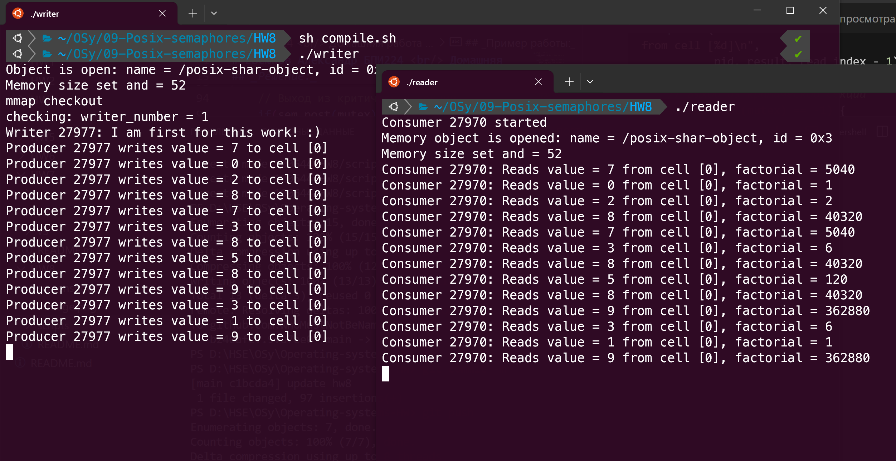

# Евсюков Александр БПИ224 <br/> Домашняя работа №8
## _Условие:_
Модифицировать последнюю рассмотренную программу таким образом, чтобы данные в буфер записывались по кольцу и читались из него в том же порядке. Синхронизацию читателя и писателя при этом можно не менять. Сохранить также возможность работы одного писателя и одного читателя.

_Опционально +1 балл_

Использовать в программе с кольцевым буфером два раздельных мьютекса, реализуемых посредством POSIX–семафоров. Отдельно для читателей и писателей (аналогично решению в программе по курсу "Архитектура ВС", реализованному для многопоточного приложения).

_Опционально +1 балл_

Переработать код так, чтобы он допускал подключение до двух читателей при одном писателе с возможным завершением (как и реализовано в примере) всех процессов по завершению одного из них.
Предоставить только один вариант программы. Опциональные решения можно реализовать как одну из альтернатив. То есть каждая из них не зависит от другой.
Дополнительно к отчету, в котором описать проделанную работу, предоставить исходные тексты программ.

## _Решение:_
Для записи данных в виде кольцевого буфера были внесены следующие изменения:

`writer.c`
``` c
// Переменная для отслеживания текущей ячейки для записи
static int write_index = 0;

// Алгоритм писателя
while (1) {
    // Проверка заполнения буфера (ждать если полон)
    if(sem_wait(empty) == -1) { //защита операции записи
        perror("sem_wait: Incorrect wait of empty semaphore");
        exit(-1);
    };

    //критическая секция, конкуренция с читателем
    if(sem_wait(mutex) == -1) {
        perror("sem_wait: Incorrect wait of mutex");
        exit(-1);
    };

    // Запись в текущую ячейку и переход к следующей по кольцу
    buffer->store[write_index] = rand() % 11; // число от 0 до 10
    write_index = (write_index + 1) % BUF_SIZE; // Переход к следующей ячейке

    //количество занятых ячеек увеличилось на единицу
    if(sem_post(full) == -1) {
        perror("sem_post: Incorrect post of full semaphore");
        exit(-1);
    };

    // Выход из критической секции
    if(sem_post(mutex) == -1) {
        perror("sem_post: Incorrect post of mutex semaphore");
        exit(-1);
    };

    sleep(rand() % 3 + 1); // Задержка перед следующей записью
}
```

`reader.c`
``` c
// Переменная для отслеживания текущей ячейки для чтения
static int read_index = 0;

// Алгоритм читателя
while (1) {
    sleep(rand() % 3 +1); // Задержка перед чтением

    // Контроль наличия элементов в буфере
    if(sem_wait(full) == -1) {
        perror("sem_wait: Incorrect wait of full semaphore");
        exit(-1);
    };

    //критическая секция
    if(sem_wait(mutex) == -1) {
        perror("sem_wait: Incorrect wait of busy semaphore");
        exit(-1);
    };

    // Чтение из текущей ячейки и переход к следующей по кольцу
    int result = buffer->store[read_index];
    buffer->store[read_index] = -1; // Помечаем ячейку как пустую
    read_index = (read_index + 1) % BUF_SIZE; // Переход к следующей ячейке

    //количество свободных ячеек увеличилось на единицу
    if(sem_post(empty) == -1) {
        perror("sem_post: Incorrect post of free semaphore");
        exit(-1);
    };

    // Вывод информации об операции чтения
    pid_t pid = getpid();
    printf("Consumer %d: Reads value = %d from cell [%d]\n",
           pid, result, read_index - 1);

    // Выход из критической секции
    if(sem_post(mutex) == -1) {
        perror("sem_post: Incorrect post of mutex semaphore");
        exit(-1);
    };
}
```

## _Пример работы:_
